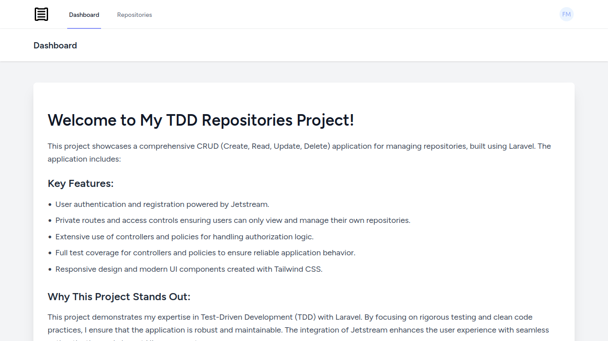
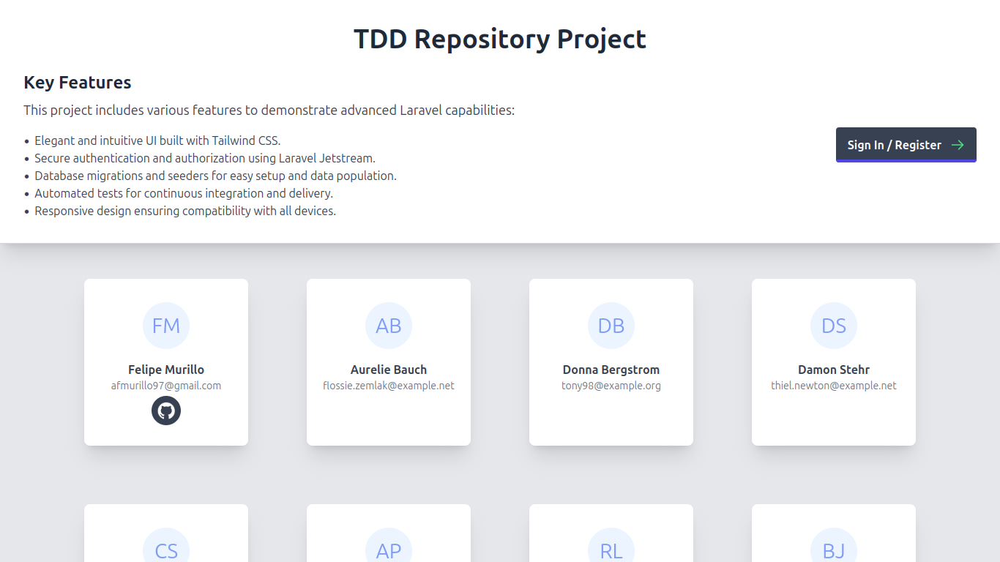
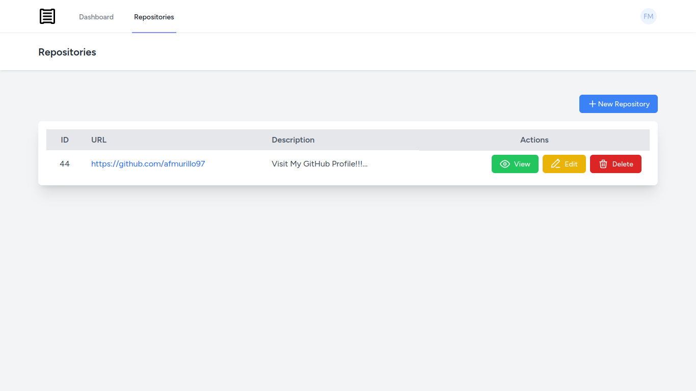
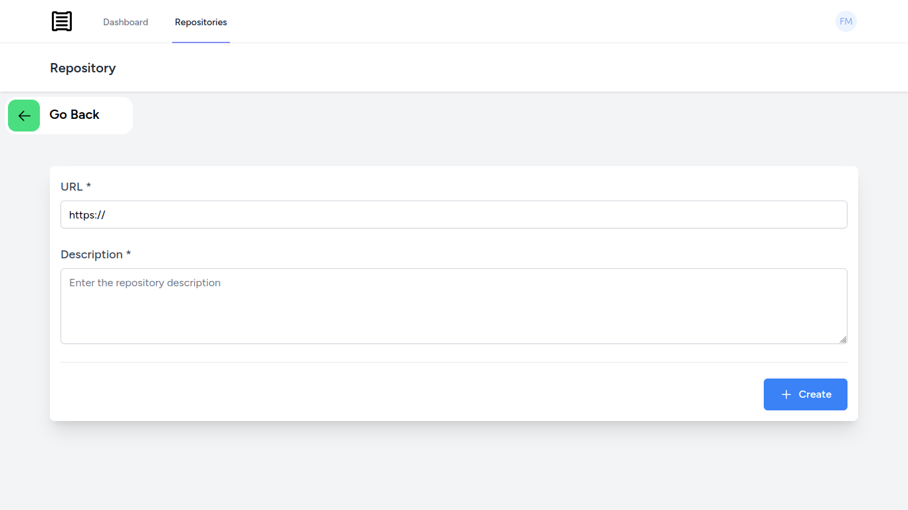

<!-- Improved compatibility of back to top link: See: https://github.com/othneildrew/Best-README-Template/pull/73 -->
<a name="readme-top"></a>
<!--
*** Thanks for checking out the Best-README-Template. If you have a suggestion
*** that would make this better, please fork the repo and create a pull request
*** or simply open an issue with the tag "enhancement".
*** Don't forget to give the project a star!
*** Thanks again! Now go create something AMAZING! :D
-->


<!-- PROJECT SHIELDS -->
<!--
*** I'm using markdown "reference style" links for readability.
*** Reference links are enclosed in brackets [ ] instead of parentheses ( ).
*** See the bottom of this document for the declaration of the reference variables
*** for contributors-url, forks-url, etc. This is an optional, concise syntax you may use.
*** https://www.markdownguide.org/basic-syntax/#reference-style-links
-->
[![LinkedIn][linkedin-shield]][linkedin-url]


<!-- PROJECT LOGO -->
<br />
<div align="center">
  <a href="#" target="_blank">
    
  </a>

  <h3 align="center">Laravel TDD Repository</h3>

  <p align="center">
    Welcome to the Laravel TDD Repos project, where meticulous craftsmanship meets cutting-edge development practices. This project showcases the power of Laravel, a leading PHP framework beloved for its elegance and developer-friendly features. At its core, Laravel TDD Repos embodies the principles of Test-Driven Development (TDD), ensuring robustness and reliability from the ground up.
    <hr>
    - **CRUD Operations with Precision**: Laravel TDD Repos enables seamless Create, Read, Update, and Delete operations for managing repositories, all designed with precision and efficiency.
    - **Secure User Management**: Built-in authentication and authorization using Laravel Jetstream ensure that user data and actions are secure and managed with ease.
    - **Modern Design with Tailwind CSS**: The project boasts a sleek and responsive design thanks to Tailwind CSS, allowing for a visually stunning and user-friendly experience.
    - **Comprehensive Testing Suite**: Every feature is rigorously tested to uphold the highest standards of quality assurance, validating functionality and performance.
    - **Empowering Developer Experience**: Leveraging Laravel's ecosystem, this project empowers developers to innovate and iterate swiftly, fostering a creative environment for building scalable web applications.
    Whether you're exploring the world of Laravel or seeking a showcase of TDD best practices, Laravel TDD Repos stands as a testament to craftsmanship and innovation in web development. Dive in and experience the future of PHP web applications with us.
    <br />
    <a href="https://github.com/afmurillo97/laravel_TDD"><strong>Explore the docs »</strong></a>
    <br />
    <br />
    <a href="#" target="_blank">View Project</a>
    ·
  </p>
</div>

<!-- GETTING STARTED -->
## Getting Started

To enter the repository system up and running on your local machine.

### Step-by-Step Setup

1. **Clone the Repository:**
   - Open your terminal.
   - Run the following command to clone the repository:
     ```sh
     git clone git@github.com:afmurillo97/laravel_TDD.git
     ```
   - Navigate to the project directory:
     ```sh
     cd laravel_TDD
     ```

2. **Install Dependencies:**
   - Run the following command to install the necessary dependencies using Composer:
     ```sh
     composer install & npm install
     ```
3. **Run Migrations and seed:**
   - Run the following command to populate the database using artisan:
     ```sh
     php artisan migrate --seed
     ```
4. **Serve the Application:**
   - Start the Laravel development server and Vite server by running:
     ```sh
     php artisan serve & npm run dev
     ```

5. **Access the Application:**
   - Open your web browser and visit the following URL to see the project in action:
     [http://127.0.0.1:8000](http://127.0.0.1:8000)
   - Or create an user account in:
     [http://127.0.0.1:8000/register](http://127.0.0.1:8000/register)

Now you should be able to view and interact with the repository system locally.

<!-- SCREENSHOTS -->
## Screenshots

<div align="center">
  
  <p>Start Project</p>
  
  
  <p>Repositories Section</p>
  
  
  <p>Create Repository Section</p>
</div>

<p align="right">(<a href="#readme-top">back to top</a>)</p>

### Built With

This section should list any major frameworks/libraries used to bootstrap my project.

* [![PHP][PHP.dev]][PHP-url]
* [![Laravel][Laravel.com]][Laravel-url]
* [![Javascript][Javascript.dev]][Javascript-url]
* [![MySQL][MySQL.com]][MySQL-url]
* [![Tailwind CSS][TailwindCSS.dev]][TailwindCSS-url]
* [![Alpine.js][AlpineJS.dev]][AlpineJS-url]

<p align="right">(<a href="#readme-top">back to top</a>)</p>

<!-- LICENSE -->
## License

Distributed under the MIT License. See `LICENSE.txt` for more information.

<p align="right">(<a href="#readme-top">back to top</a>)</p>

<!-- CONTACT -->
## Contact

Felipe Murillo - [@murilloaf](https://twitter.com/murilloaf) - afmurillo97@gmail.com

Project Link: [https://github.com/afmurillo97/laravel_TDD](https://github.com/afmurillo97/laravel_TDD)

<p align="right">(<a href="#readme-top">back to top</a>)</p>


<!-- ACKNOWLEDGMENTS -->
## Acknowledgments

I'd like to express my gratitude to the following libraries and tools that have been instrumental in the development of ElectroniTech:

* [Composer](https://getcomposer.org) - Dependency manager for PHP.
* [PHP](https://www.php.net) - Server-side scripting language used in the backend development.
* [Laravel](https://laravel.com) - The PHP framework for web artisans.
* [Laravel Jetstream](https://jetstream.laravel.com) - Provides a beautiful, robust starting point for Laravel applications.
* [Tailwind CSS](https://tailwindcss.com) - A utility-first CSS framework for rapidly building custom designs.

These resources have significantly contributed to the success and functionality of the Repository project.


<p align="right">(<a href="#readme-top">back to top</a>)</p>


<!-- MARKDOWN LINKS & IMAGES -->
<!-- https://www.markdownguide.org/basic-syntax/#reference-style-links -->
[contributors-shield]: https://img.shields.io/github/contributors/othneildrew/Best-README-Template.svg?style=for-the-badge
[contributors-url]: https://github.com/othneildrew/Best-README-Template/graphs/contributors
[forks-shield]: https://img.shields.io/github/forks/othneildrew/Best-README-Template.svg?style=for-the-badge
[forks-url]: https://github.com/othneildrew/Best-README-Template/network/members
[stars-shield]: https://img.shields.io/github/stars/othneildrew/Best-README-Template.svg?style=for-the-badge
[stars-url]: https://github.com/othneildrew/Best-README-Template/stargazers
[issues-shield]: https://img.shields.io/github/issues/othneildrew/Best-README-Template.svg?style=for-the-badge
[issues-url]: https://github.com/othneildrew/Best-README-Template/issues
[license-shield]: https://img.shields.io/github/license/othneildrew/Best-README-Template.svg?style=for-the-badge
[license-url]: https://github.com/othneildrew/Best-README-Template/blob/master/LICENSE.txt
[linkedin-shield]: https://img.shields.io/badge/-LinkedIn-black.svg?style=for-the-badge&logo=linkedin&colorB=555
[linkedin-url]: https://www.linkedin.com/in/felipe-murillov/
[product-screenshot]: images/screenshot.png
[Next.js]: https://img.shields.io/badge/next.js-000000?style=for-the-badge&logo=nextdotjs&logoColor=white
[Next-url]: https://nextjs.org/
[React.js]: https://img.shields.io/badge/React-20232A?style=for-the-badge&logo=react&logoColor=61DAFB
[React-url]: https://reactjs.org/
[Vue.js]: https://img.shields.io/badge/Vue.js-35495E?style=for-the-badge&logo=vuedotjs&logoColor=4FC08D
[Vue-url]: https://vuejs.org/
[Angular.io]: https://img.shields.io/badge/Angular-DD0031?style=for-the-badge&logo=angular&logoColor=white
[Angular-url]: https://angular.io/
[Svelte.dev]: https://img.shields.io/badge/Svelte-4A4A55?style=for-the-badge&logo=svelte&logoColor=FF3E00
[Svelte-url]: https://svelte.dev/
[PHP.dev]: https://img.shields.io/badge/php-url?style=for-the-badge&logo=php&logoColor=%23FFFFFF&labelColor=%23777BB4&color=%23777BB4
[PHP-url]: https://php.net/
[Composer.dev]: https://img.shields.io/badge/composer-url?style=for-the-badge&logo=composer&logoColor=%23FFFFFF&labelColor=%23885630&color=%23885630
[Composer-url]: https://getcomposer.org
[Javascript.dev]: https://img.shields.io/badge/javascript-url?style=for-the-badge&logo=javascript&logoColor=%23FFFFFF&labelColor=%23F7DF1E&color=%23F7DF1E
[Javascript-url]: https://javascript.com
[Laravel.com]: https://img.shields.io/badge/Laravel-FF2D20?style=for-the-badge&logo=laravel&logoColor=white
[Laravel-url]: https://laravel.com
[Bootstrap.com]: https://img.shields.io/badge/Bootstrap-563D7C?style=for-the-badge&logo=bootstrap&logoColor=white
[Bootstrap-url]: https://getbootstrap.com
[JQuery.com]: https://img.shields.io/badge/jQuery-0769AD?style=for-the-badge&logo=jquery&logoColor=white
[JQuery-url]: https://jquery.com
[MySQL.com]: https://img.shields.io/badge/mysql-url?style=for-the-badge&logo=mysql&logoColor=%23FFFFFF&labelColor=%234479A1&color=%234479A1
[MySQL-url]: https://mysql.com 
[TailwindCSS.dev]: https://img.shields.io/badge/tailwind-url?style=for-the-badge&logo=tailwindcss&logoColor=%23FFFFFF&color=%2306B6D4
[TailwindCSS-url]: https://tailwindcss.com
[AlpineJS.dev]: https://img.shields.io/badge/Alpine%20js-url?style=for-the-badge&logo=alpinedotjs&logoColor=%23FFFFFF&color=%238BC0D0
[AlpineJS-url]: https://alpinejs.dev
